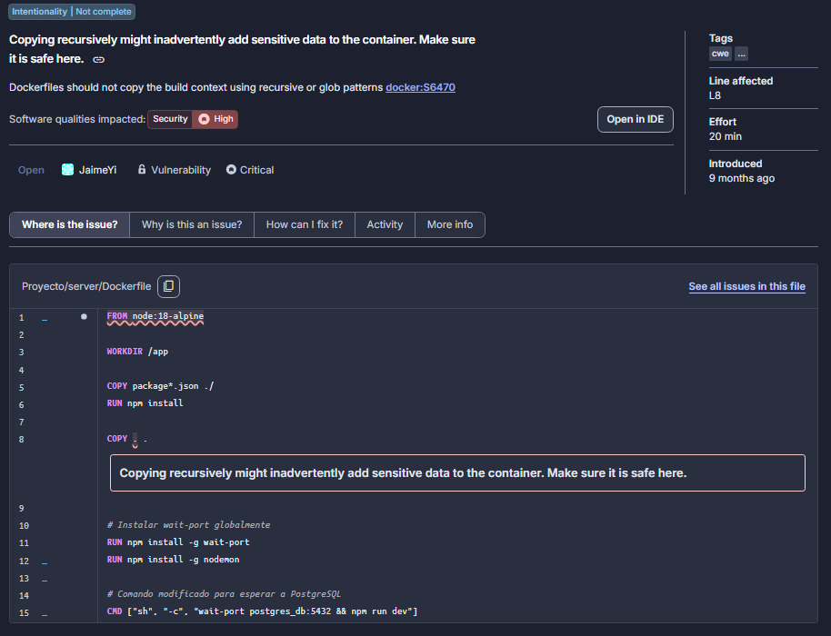
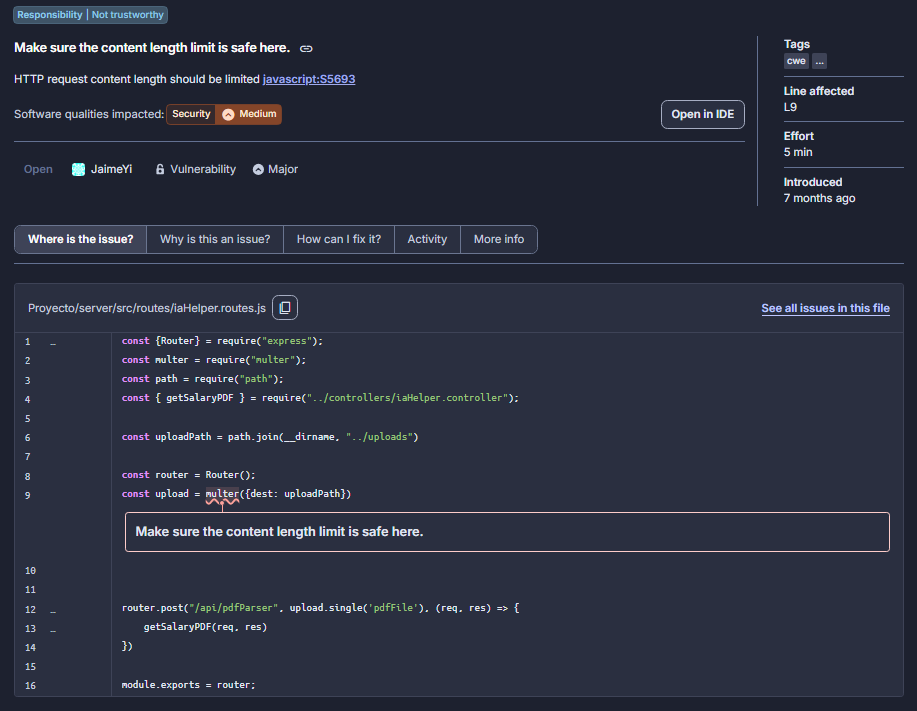

# Inspección de Código Estática con SonarCloud

**Carpeta de Versionamiento:** `inspections/`

---

## 1. Documentación de Quality Issues Seleccionados

Mediante el análisis estático realizado por SonarCloud, se identificaron 9 brechas de seguridad totales. A continuación se trabajará en la infraestructura de despliegue y en las rutas de integración con Inteligencia Artificial que consideramos las más importantes debido a tener una severidad Crítica y Mayor respectivamente según SonarClourd. A continuación se documentan los dos hallazgos de mayor gravedad:

### Quality Issue 1: Copiado recursivo inseguro en contenedor
* **Archivo afectado:** `Proyecto/server/Dockerfile` (Línea 8)
* **Tipo:** Vulnerabilidad de Seguridad
* **Severidad:** CRITICAL
* **Esfuerzo de resolución:** [20 min]
* **Evidencia Visual:**
  
* **Descripción del problema:** La instrucción `COPY . .` transfiere recursivamente todo el directorio de trabajo local hacia la imagen de Docker. Esto representa un riesgo crítico de fuga de información, ya que inadvertidamente se pueden empaquetar archivos sensibles como variables de entorno (`.env`), historiales locales de Git (`.git`) o credenciales quemadas.

---

### Quality Issue 2: Ausencia de límite de payload en rutas de IA
* **Archivo afectado:** `Proyecto/server/src/routes/iaHelper.routes.js` (Línea 9)
* **Tipo:** Vulnerabilidad de Seguridad
* **Severidad:** MAJOR
* **Esfuerzo de resolución:** [5 min]
* **Evidencia Visual:**
  
* **Descripción del problema:** El endpoint receptor de documentos para el análisis de Inteligencia Artificial no declara explícitamente un límite en el tamaño del cuerpo de la petición (*Content-Length*). Esto deja al servidor expuesto a ataques de Denegación de Servicio (DoS) por saturación de memoria frente a cargas masivas de datos.

---

## 2. Recomendaciones y Rationale de Abordaje

En cumplimiento con las directrices de mejora continua de las Historias de Usuario, el equipo adopta las siguientes resoluciones:

1. **Abordaje de Quality Issue 1 (Aprobado):** Se solucionará creando un archivo `.dockerignore` en la raíz del servidor para excluir explícitamente carpetas temporales y archivos secretos (`.env`, `node_modules`), garantizando una construcción limpia y segura.
2. **Abordaje de Quality Issue 2 (Aprobado):** Se solucionará configurando explícitamente el parámetro `limit` en el middleware analizador de cuerpos de Express (ej. `express.json({ limit: '10mb' })`), mitigando vectores de ataque de denegación de servicio.
3. **Advertencias Menores no abordadas:** Se descarta invertir tiempo de ciclo en corregir advertencias de registro en consola (*Change this code to not log user-controlled data*) presentes en el frontend web (`register.js`, `simulator.jsx`), catalogadas con severidad *Minor*. La justificación radica en priorizar la estabilidad del backend y la ejecución de pruebas de carga en JMeter.