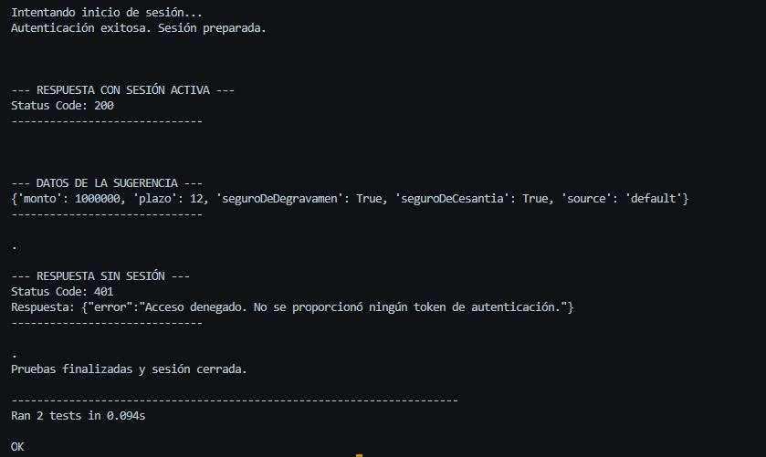
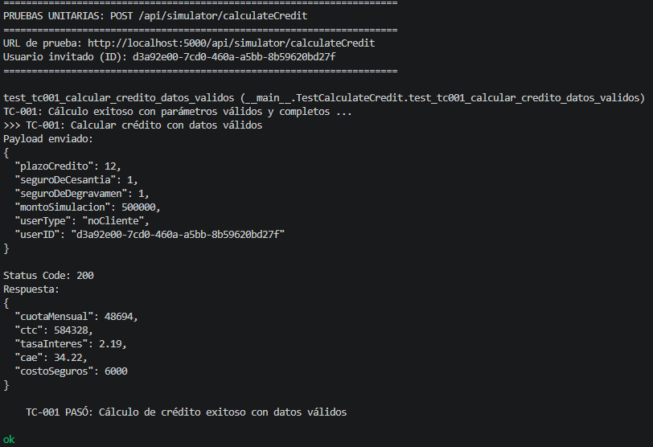
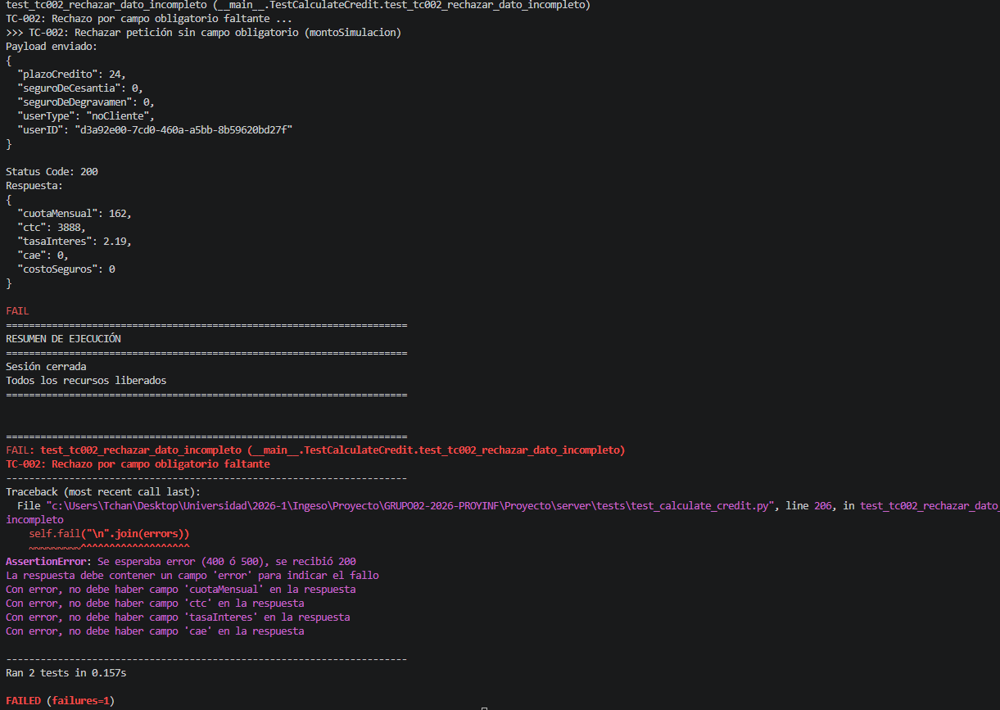

#### PRUEBAS UNITARIAS - ENDPOINT 1

##### GET /api/simulator/suggestedLoan

###### Descripción
Documentación de las pruebas unitarias para el endpoint de **Sugerencia de Monto Óptimo y Plazo**. Este endpoint personaliza la oferta financiera basándose en diferentes valores.

**HU Asociada:** HU-8 (Sugerencia de monto óptimo y plazo)

**Framework:** Python unittest

**Casos de Prueba:** 2 

---

##### Casos de Prueba

###### Usuario Autenticado
- **Id del caso:** TC-001
- **Clase de Equivalencia:** Usuario con sesión activa y válida
- **Entrada:** Petición GET al endpoint con cookie de sesión generada mediante un login exitoso
- **Salida Esperada:** Status 200 OK + Objeto JSON con los campos `monto`, `plazo`, `seguroDeDegravamen`, `seguroDeCesantia` y `source`
- **Validaciones:** Se verifica la integridad de la sesión y que la lógica de prioridad (Campaña > Historial > Default) entregue una respuesta estructurada

###### Sesión Inactiva
- **Id del caso:** TC-002 
- **Clase de Equivalencia:** Usuario con acceso no autorizado
- **Entrada:** Petición GET directa al endpoint sin cabeceras de autenticación ni cookies de sesión
- **Salida Esperada:** Status 401 Unauthorized
- **Validaciones:** Se comprueba que el middleware `verifyToken` bloquee correctamente el acceso a datos sensibles de clientes si no existe una sesión activa

---

###### Tabla 1: Caso de Prueba 1

| Campo | Descripción |
| :--- | :--- |
| **Historia de Usuario (HU)** | HU: Sugerencia de Monto Óptimo y Plazo |
| **Post-it / Tarea asociada** | Escaneo de documentos y Generacion de ofertas personalizadas |
| **Nombre del Test** | `test_obtener_sugerencia_con_auth_automatica` |
| **Contexto de ejecución** | El servidor backend está operativo en el puerto 5000. El cliente (script) inicia sesión previamente con credenciales válidas en `/api/userManagement/login` y guarda la cookie de sesión (`token`). Se consulta el endpoint `GET /api/simulator/suggestedLoan`. |
| **Inputs (Entradas)** | Cookie de sesión válida adjunta en los *Headers* de la petición. |
| **Salida Esperada** | Código HTTP 200 OK. Un objeto JSON que contiene los datos del préstamo sugerido validando que el procedimiento ha sido correcto. |

---

###### Tabla 2: Caso de Prueba 2 (Seguridad)

| Campo | Descripción |
| :--- | :--- |
| **Historia de Usuario (HU)** | HU: Sugerencia de Monto Óptimo y Plazo |
| **Post-it / Tarea asociada** | Escaneo de documentos y Generacion de ofertas personalizadas |
| **Nombre del Test** | `test_rechazo_sin_sesion` |
| **Contexto de ejecución** | El servidor backend está operativo. Se simula un intento de acceso no autorizado saltándose el login. Se realiza una petición directa al endpoint protegido `GET /api/simulator/suggestedLoan`. |
| **Inputs (Entradas)** | Petición HTTP GET **sin** ninguna cookie de sesión o token. |
| **Salida Esperada** | Código HTTP 401 Unauthorized. El sistema bloquea el procesamiento y no devuelve datos financieros; el middleware `verifyToken` detiene la solicitud antes de llegar al servicio. |

##### Anexo: Evidencias y Guía de Replicación de Resultados

Este apartado proporciona screenshots de las pruebas realizadas y los pasos técnicos necesarios para replicar los resultados.

---

###### 1. Evidencias de Ejecución (Screenshots)

###### 2. Guía para Replicar los Resultados

Para asegurar la correcta ejecución de los tests unitarios y la validación de la HU de "Sugerencia de Monto Óptimo y pllazo", se debe seguir este procedimiento

1. Se debe levantar el Backend y la base de datos. 

2. Dado que el **Test 1** requiere una sesion autentica para consultar los datos, se debe registrar manualmente un usuario.

3. En `Proyecto/server/tests/test_sugerencia_optima.py` debe localizar el diccionario `payload_login` y asegurarse que el *RUT* y *contraseña* sean las mismas que se utilizaron para registrarse.

4. Luego se debe ejecutar el archivo `test_sugerencia_optima.py`

___  

#### PRUEBAS UNITARIAS - ENDPOINT 2

##### POST /api/simulator/calculateCredit

##### Descripción
- **Endpoint:** `POST /api/simulator/calculateCredit`
- **Descripción:** Calcula un crédito de consumo con seguros y genera un registro en el historial
- **Framework:** Python unittest
- **HU Asociada:** HU-1 (Simulación de préstamo)

---

##### Casos de Prueba

###### Cálculo Exitoso con Datos Válidos
- **Id del caso:** TC-003
- **Clase de Equivalencia:** Valores normales y completos.
- **Entrada:** Petición POST al endpoint con un payload JSON que incluye todos los campos obligatorios y válidos.
- **Salida Esperada:** Status 200 OK + Objeto JSON con los cálculos correspondientes.
- **Validaciones:** Se verifica que el status code sea 200, que todos los valores devueltos sean mayores a 0, que el cálculo lógico del costo de seguros y el CTC sean correctos.

###### Rechazo por Datos Incompletos
- **Id del caso:** TC-004 
- **Clase de Equivalencia:** Valor faltante en campo obligatorio (Frontera / Inválida)
- **Entrada:** Petición POST al endpoint omitiendo intencionalmente el campo obligatorio `montoSimulacion` dentro del payload JSON, pero enviando el resto de los parámetros correctamente.
- **Salida Esperada:** Status 400 Bad Request o 500 Internal Server Error + Objeto JSON indicando el error.
- **Validaciones:** Se comprueba que el sistema rechace la solicitud por la falta de un campo clave, que no se generen datos financieros en la respuesta ni se registre una simulación inválida en la base de datos.

---
###### Tabla 3: Caso de Prueba 1

| Campo | Descripción |
| :--- | :--- |
| **Historia de Usuario (HU)** | HU-001: Simulación de préstamo |
| **Post-it / Tarea asociada** | Inputs de simulación de préstamo válidos |
| **Nombre del Test** | `test_tc003_calcular_credito_datos_validos` |
| **Contexto de ejecución** | El servidor backend está operativo en el puerto 5000. Se simula la petición de un usuario invitado (noCliente) generando un UUID aleatorio para la sesión. Se consulta el endpoint `POST /api/simulator/calculateCredit` |
| **Inputs (Entradas)** | Payload JSON en el cuerpo de la petición con todos los campos válidos: `plazoCredito` (12), `seguroDeCesantia` (1), `seguroDeDegravamen` (1), `montoSimulacion` (500000), `userType` ("noCliente") y `userID` (UUID). |
| **Salida Esperada** | Código HTTP 200 OK. Un objeto JSON que contiene los resultados matemáticos del crédito (`cuotaMensual`, `ctc`, `tasaInteres`, `cae`, `costoSeguros`), validando que el cálculo es correcto y los valores son mayores a 0. |
---
###### Tabla 4: Caso de Prueba 2

| Campo | Descripción |
| :--- | :--- |
| **Historia de Usuario (HU)** | HU-001: Simulación de préstamo |
| **Post-it / Tarea asociada** | Manejo de errores y validación de campos obligatorios en el simulador |
| **Nombre del Test** | `test_tc004_rechazar_dato_incompleto` |
| **Contexto de ejecución** | El servidor backend está operativo en el puerto 5000. Se envía una petición simulando un usuario invitado, pero se omite intencionalmente un dato crucial para forzar la validación de seguridad del endpoint `POST /api/simulator/calculateCredit` |
| **Inputs (Entradas)** | Payload JSON en el cuerpo de la petición incompleto. Faltando intencionalmente el campo obligatorio `montoSimulacion`. Se envían los demás datos correctamente. |
| **Salida Esperada** | Código HTTP 400 Bad Request o 500 Internal Server Error. Un objeto JSON que contiene un mensaje de error indicando el fallo, asegurando que no se entreguen cálculos financieros (`cuotaMensual`, `ctc`, etc.) si faltan datos base. |

---

##### Relación con Historias de Usuario

###### HU-001: Simular Crédito de Consumo
**Descripción:** Como cliente, quiero simular distintas condiciones de préstamo (monto, plazo, tasa de interés, valor cuota) para poder así comparar opciones y elegir la que mejor se adapte a mi capacidad de pago.

**Escenarios cubiertos:**
- **Escenario 1 (TC-003):** Usuario ingresa datos válidos → sistema calcula crédito → muestra resultado
- **Escenario 2 (TC-004):** Usuario omite campo → sistema rechaza → muestra error 

---

##### Anexo: Evidencias y Guía de Replicación de Resultados

###### Evidencia de ejecución (ScreenShot) para TC-003

###### Evidencia de ejecución (ScreenShot) para TC-004

###### Observaciones sobre el caso TC-004
Análisis del Defecto: Al ejecutar la prueba, el sistema no rechazó la solicitud incompleta. En lugar de devolver el código de error esperado (400 o 500), la API respondió con un `Status Code: 200 OK` y calculó valores financieros que no se deberían haber calculado (ej. `cuotaMensual: 162`) basándose en la ausencia del campo obligatorio `montoSimulacion`. Esto evidencia una falta de validación en la capa del controlador del endpoint, aún así el código logra manejar el error y conservar la ejecución del script,
no obstante decidimos dejar la entrega de esta manera debido a las sugerencias del hito 3.